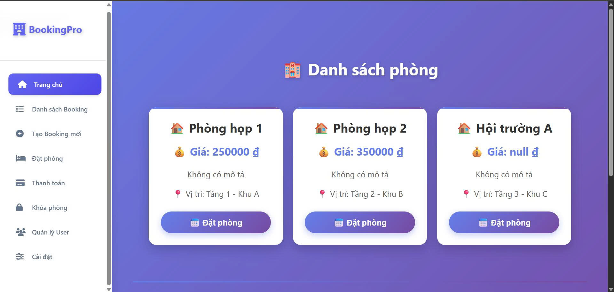
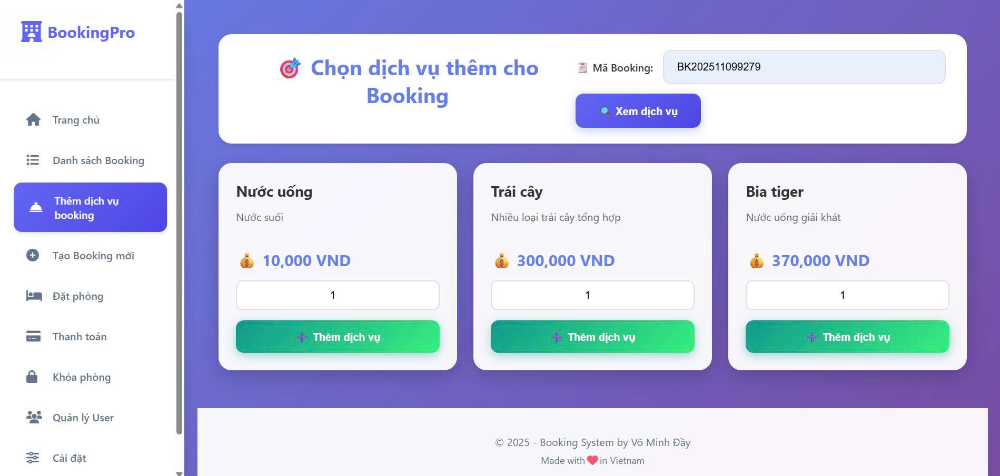
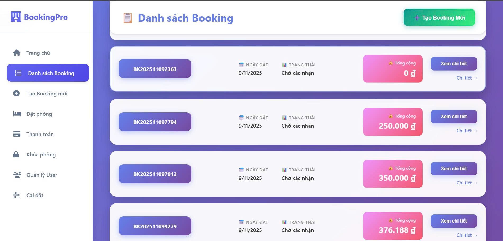
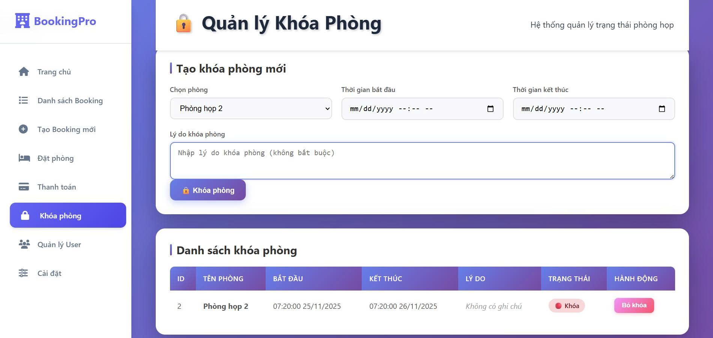
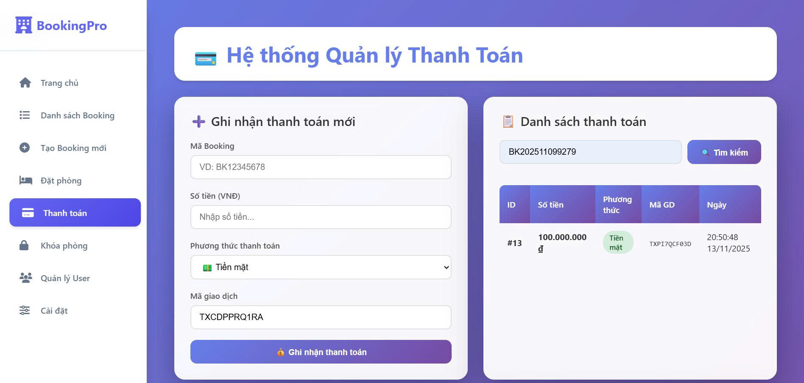
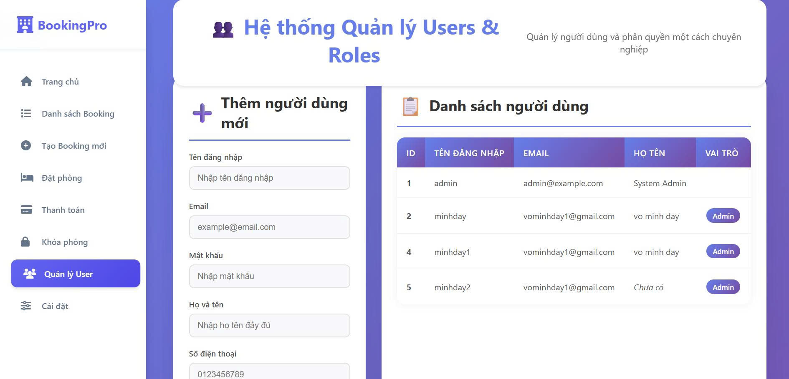

<!-- Tiêu đề -->
<h1 align="center" style="font-size: 36px; font-weight: bold; margin-bottom: 10px;">
  Booking Management System
</h1>

  Hệ thống quản lý đặt phòng & dịch vụ – API Backend

<h2>📌 Giới thiệu</h2>

  Dự án mô phỏng hệ thống <b>Quản lý đặt phòng & dịch vụ</b> dành cho khách hàng và admin,
  bao gồm các chức năng: đặt phòng, quản lý tài nguyên, dịch vụ, thanh toán, phân quyền người dùng
  và báo cáo thống kê.

  Mục tiêu chính là xây dựng một API Back-End hoàn chỉnh để có thể tích hợp với Web App, Mobile App
  hoặc hệ thống quản trị nội bộ. Hệ thống được thiết kế theo mô hình RESTful API, sử dụng Stored Procedures
  cho các nghiệp vụ quan trọng và hỗ trợ kiểm tra trùng lịch, validate nghiệp vụ và tính tổng chi phí.

<h2>🚀 Các nhóm nghiệp vụ</h2>

<!-- 1. Booking -->
<h3>1️⃣ Quản lý Booking (Đặt chỗ)</h3>
<ul>
  <li>Tạo, xem, hủy và cập nhật trạng thái đơn đặt phòng.</li>
  <li>API chính: <code>GET /api/bookings</code>, <code>POST /api/bookings</code></li>
  <li>Stored Procedure: <code>CreateBooking</code>.</li>
</ul>

<!-- Ảnh minh họa Booking -->

  
  

      
      
  

  
Giao diện Booking

<!-- 2. Booking Items -->
<h3>2️⃣ Quản lý Booking Items (Phòng & Thời gian)</h3>
<ul>
  <li>Chọn phòng, chọn giờ, kiểm tra trùng lịch.</li>
  <li>Xử lý conflict thời gian và validate nghiệp vụ.</li>
</ul>

  
  
Minh họa chọn phòng & thời gian

<!-- 3. Services -->
<h3>3️⃣ Quản lý Services (Dịch vụ thêm)</h3>
<ul>
  <li>Khách có thể chọn thêm các dịch vụ phụ (nước uống, dọn dẹp...).</li>
  <li>Tổng tiền booking tự động cập nhật.</li>
</ul>

  
  
Danh sách dịch vụ

<!-- 4. Resources -->
<h3>4️⃣ Quản lý Resources & Venues</h3>
<ul>
  <li>CRUD phòng & địa điểm.</li>
  <li>Thiết lập quan hệ 1-n (Venue → Resource).</li>
</ul>

  
  
Danh sách phòng & địa điểm

<!-- 5. Overrides -->
<h3>5️⃣ Quản lý Availability Overrides (Khóa phòng)</h3>
<ul>
  <li>Admin có thể chặn phòng để bảo trì.</li>
  <li>Tự động kiểm tra xung đột với booking hiện tại.</li>
</ul>

  
  
Khóa phòng (Override)

<!-- 6. Payments -->
<h3>6️⃣ Quản lý Payments (Thanh toán)</h3>
<ul>
  <li>Ghi nhận thanh toán, lịch sử giao dịch.</li>
  <li>Báo cáo doanh thu theo thời gian.</li>
</ul>

  
  
Báo cáo thanh toán

<!-- 7. Users -->
<h3>7️⃣ Quản lý Users & Roles</h3>
<ul>
  <li>Đăng nhập, phân quyền Admin/User.</li>
  <li>JWT Authentication & Hash mật khẩu.</li>
</ul>

  
  
Quản lý người dùng

<!-- 8. Reports -->
<h3>8️⃣ Báo cáo</h3>
<ul>
  <li>Số lượng đặt chỗ theo tháng.</li>
  <li>Doanh thu theo từng Venue.</li>
  <li>Top phòng được đặt nhiều nhất.</li>
</ul>

  
  
Biểu đồ báo cáo

<h2>🛠️ Công nghệ sử dụng</h2>
<ul>
  <li><b>Backend:</b> ASP.NET Core Web API</li>
  <li><b>Database:</b> SQL Server</li>
  <li><b>Authentication:</b> JWT</li>
  <li><b>Testing:</b> Postman, Swagger</li>
</ul>
