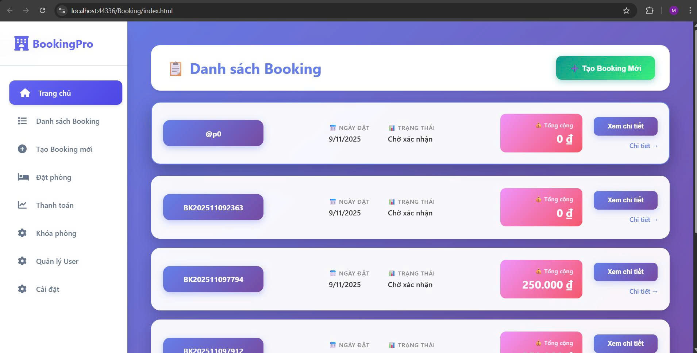

# Booking Management System

## 📌 Giới thiệu
Dự án này mô phỏng hệ thống **Quản lý đặt phòng & dịch vụ** cho khách hàng và admin.  
Mục tiêu: xây dựng API backend với đầy đủ nghiệp vụ cơ bản, quản trị, hệ thống và báo cáo.

## 🚀 Các nhóm nghiệp vụ

### 1️⃣ Quản lý Booking (Đặt chỗ)
- Tạo, xem, hủy và xác nhận đơn đặt phòng
- API: `GET /api/bookings`, `POST /api/bookings`, `PUT /api/bookings/{id}/status`, `DELETE /api/bookings/{id}`
- Thực hành: Stored Procedure `CreateBooking`, cập nhật trạng thái, join bảng Customers, BookingItems, Resources

### 2️⃣ Quản lý Booking Items (Phòng & Thời gian)
- Chọn phòng, chọn giờ, kiểm tra trùng lịch
- API: `GET /api/resources/available`, `POST /api/bookingitems`, `GET /api/bookings/{id}/items`
- Thực hành: validate thời gian, xử lý conflict, exception từ SP
	
### 3️⃣ Quản lý Services (Dịch vụ thêm)
- Cho phép khách chọn thêm dịch vụ (nước, dọn dẹp…)
- API: `GET /api/services`, `POST /api/bookingservices`, `DELETE /api/bookingservices/{id}`
- Thực hành: join Bookings, BookingServices, tính tổng tiền

### 4️⃣ Quản lý Resources & Venues
- CRUD phòng & địa điểm
- API: `GET /api/venues`, `POST /api/resources`, `PUT /api/resources/{id}`, `DELETE /api/resources/{id}`
- Thực hành: quan hệ 1-n (venue → resource)

### 5️⃣ Quản lý Availability Overrides (Khóa phòng)
- Admin chặn phòng trong khoảng thời gian bảo trì
- API: `POST /api/overrides`, `GET /api/overrides`, `DELETE /api/overrides/{id}`
- Thực hành: kiểm tra conflict với booking hiện có

### 6️⃣ Quản lý Payments (Thanh toán)
- Ghi nhận thanh toán, xem lịch sử, thống kê doanh thu
- API: `POST /api/payments`, `GET /api/payments`, `GET /api/payments/report`
- Thực hành: tính tổng tiền booking, sum theo thời gian

### 7️⃣ Quản lý Users & Roles
- Quản lý người dùng, phân quyền
- API: `GET /api/users`, `POST /api/users`, `POST /api/auth/login`, `GET /api/roles`
- Thực hành: JWT, hash password, mapping UserRoles

### 8️⃣ Báo cáo
- Số lượng đặt chỗ theo tháng
- Doanh thu theo Venue
- Top phòng được đặt nhiều nhất
- SQL mẫu: sử dụng group by, sum, join

## 🛠️ Công nghệ sử dụng
- **Backend**: ASP.NET Core / Node.js (tùy chọn triển khai)
- **Database**: SQL Server / MySQL
- **Authentication**: JWT
- **Stored Procedures**: CreateBooking, AddBookingItem, CheckResourceAvailability

## 📂 Cấu trúc dự án

  

